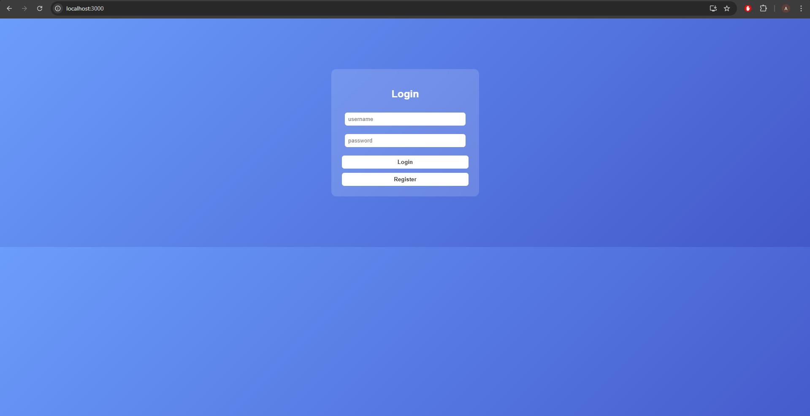
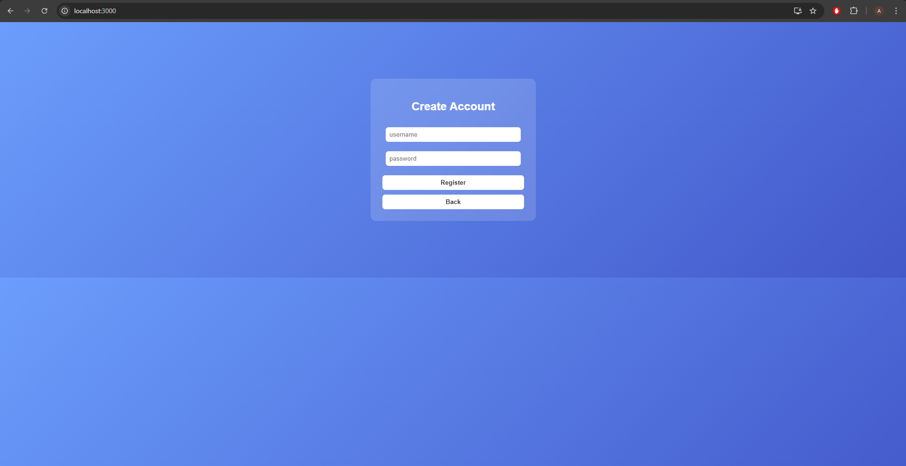
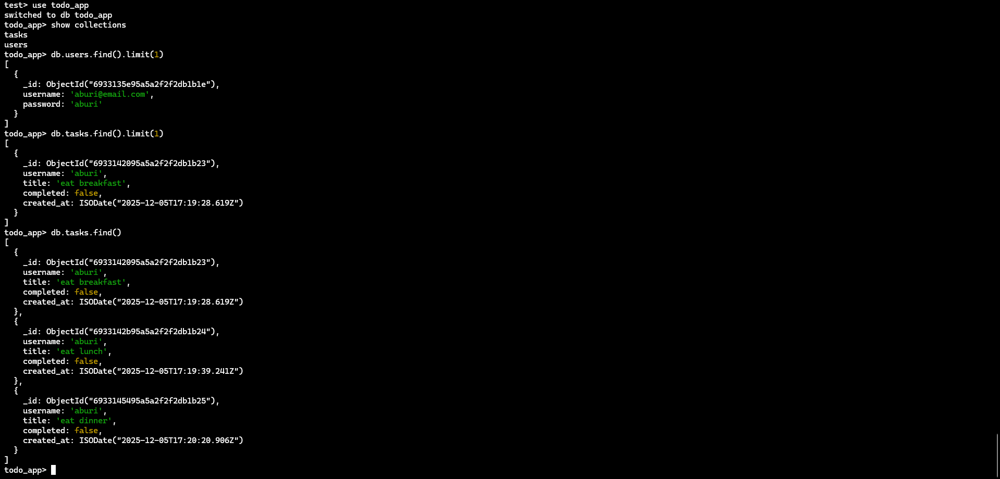

# Full-Stack Todo App (React + Flask + MongoDB)

This project is a complete full-stack Todo List application featuring user accounts, task creation and management, and a business rule preventing deletion of completed tasks older than one week. The stack is intentionally minimal: only React, Flask, MongoDB, flask-cors, and pymongo are used. Styling is done entirely through custom CSS to maintain a visually polished UI without additional libraries.


## Features

### Authentication

* User registration
* User login
* Users see only their own tasks

Note: Authentication uses basic credential checking only. No hashing or JWT is included to comply with the requirement of not adding additional libraries.

### Todo Management

* Create new tasks
* View tasks
* Toggle completion status
* Delete tasks
* Tasks are associated with the logged-in user

### Business Rule

* Completed tasks older than one week cannot be deleted.

### User Interface

* Gradient background
* Glass-card style components
* Custom CSS without external UI frameworks


## Technologies Used

### Frontend

* React (Create React App)
* Custom CSS
* Fetch API

### Backend

* Python (Flask)
* flask-cors
* pymongo

### Database

* MongoDB Community Edition (local database)

### Other Tools

* Node.js and npm
* Python virtual environments
* MongoDB Compass (optional)


# Backend Setup (Flask)

```powershell
cd backend
python -m venv venv
venv\Scripts\activate
pip install flask pymongo flask-cors
```

Run the backend server:

```powershell
python app.py
```

Backend will run at:

[http://127.0.0.1:5000](http://127.0.0.1:5000)


# Frontend Setup (React)

```powershell
cd ../frontend
npm install
npm start
```

Frontend will run at:

[http://localhost:3000](http://localhost:3000)


## Screenshots


### Login Screen



### Register Screen



### Task Dashboard


### Database Records 




## Useful Commands

### Start Flask

```powershell
cd backend
venv\Scripts\activate
python app.py
```

### Start React

```powershell
cd frontend
npm start
```

### Install Backend Dependencies

```powershell
pip install flask pymongo flask-cors
```

### Install Frontend Dependencies

```powershell
npm install
```

### Clean NPM Modules (if needed)

```powershell
rm -rf node_modules
npm install
```


## Future Scope

* Add password hashing
* Add filtering (completed, active, old tasks)
* Add categories, tags, and labels
* Add due dates and reminders
* Add pagination for large task sets
* Migrate database to MongoDB Atlas
* Add environment variable support
* Add Docker support
* Add unit tests and integration tests
* Add confirmation dialogs
* Add a dark mode theme


## License


## Additional Notes


### MongoDB Collections

Users collection:

```json
{
  "username": "john",
  "password": "1234"
}
```

Tasks collection:

```json
{
  "username": "john",
  "title": "Buy groceries",
  "completed": false,
  "created_at": "UTC timestamp"
}
```
